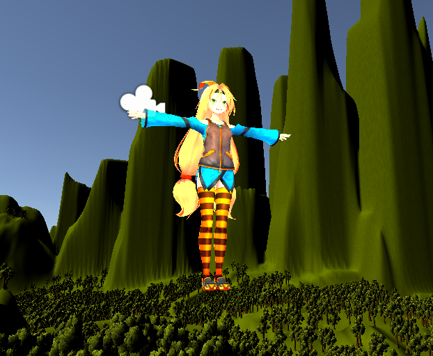

Práctica 1: Introducción a Unity
==========================

- Crear un terreno:

Vamos a GameObject > 3D Object > Terrain
Dentro del componente Terrain tenemos la herramienta pincel, que nos permite darle forma al terreno. Experimenté con varios pinceles y las formaciones que estos pueden crear. Más tarde le añadí un shader con textura de hierba la Asset Store

- Incluir dos objetos 3D básicos, por ejemplo 2 esferas:

Usamos GameObject > 3D Object > Cube y GameObject > 3D Object > Sphere
Los posicionamos en la escena editando su componente Transform.
Le dí un shader standar con emisión para que quede bien con el siguiente paso.

- La escena debe tener 2 fuentes de luz:

Dejé la luz direccional que viene en la escena y la ajuste un poco.
Añadí a la esfera y el cubo el componente Light, ajusté el color, la intensidad y el rango, obteniendo un efecto decente.

- Incluir un personaje como Ethan, de los Standard Assets:

Aquí me confundí y use uno de la Asset Store, unity-chan. Desactivé el script de Face Update    ya que su UI es molesta y no se usaría. Le añadí la cámara principal, para tener una perspectiva    de 3ª persona.

- Incluir un objeto libre de la Asset Store que no sea de los Standard Assets:

Importé un árbol y lo añadí a los terrenos con la herramienta Paint Trees.

- Cada objeto debe tener una etiqueta que lo identifique:

Añadí varios Tags, separando los objetos en grupos similares. Asigné uno a cada objeto.

- Agregar un script que escriba en la consola los objetos que se han  utilizado, un identificador numérico que le asignes a cada uno de los  objetos y el valor de un contador que se actualiza en cada iteración para cada objeto.

Creé dos scripts. Uno que toma todos los objetos directamente bajo la escena, guarda sus referencias y contador, y les asigna un id según el orden en el que los encuentra. Funciona estando incorporado en cualquier GameObject.
[PrintObjects](scripts/PrintObjects.cs)

Otro que se añade a cada GameObject como componente. Te permite dar una id personalizada al objeto. Como id predeterminada toma la id de objecto de Unity.
[HeyIamHere](scripts/HeyIamHere.cs)

